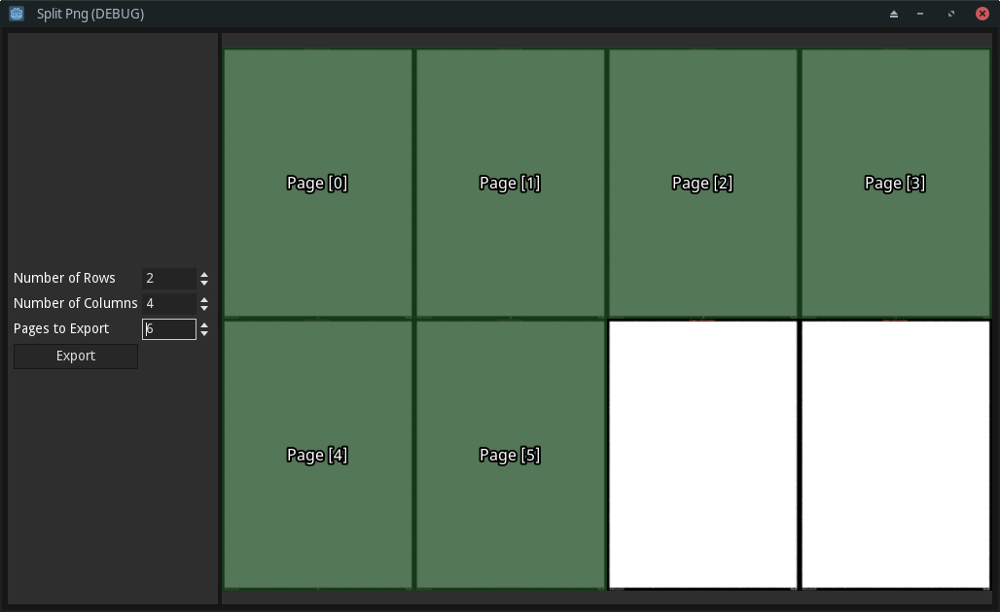

# Split Png

A small app for quickly splitting a grid of images into individual files. Just drag and drop an image, set the number of rows and columns, and select how many pages to export. It was made as a tool for myself and only implements what I need as I need it. Split Png is made with [Godot Engine](https://godotengine.org/).

# License

* Split Png (c) Quan Zillan -- MIT
* Godot (c) 2007-2022 Juan Linietsky, Ariel Manzur (c) 2014-2022 Godot Engine contributors -- [MIT](https://godotengine.org/license)
* Noto Sans (c) Google -- OFT